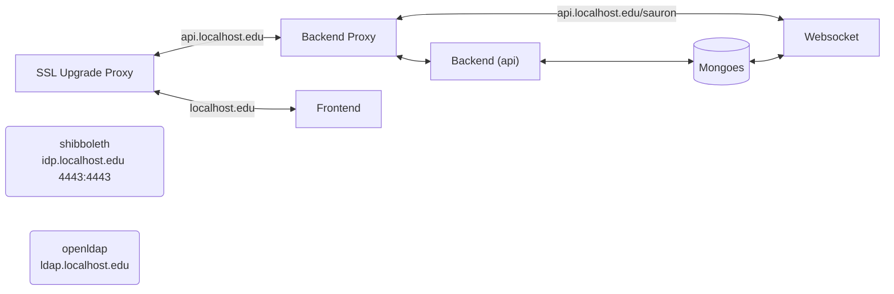
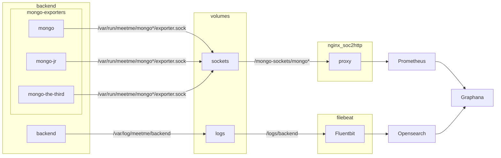

# Architecture

Meetme is build with the idea of splitting things up, things should do 1 thing.
Everything is ideally split into its own container, which is then orchestrated
using compose (either docker or podman). There are three compose files,
`docker-compose-admin`, `Docker-compose-hotload`, and `Docker-compose-prod`
(prod version of hotload, use this when deploying).

Both `Docker-compose-hotload` and `Docker-compose-prod` start up Meetme, which
includes the backend, frontend, and databases. `docker-compose-admin` can be
ran separately and independently of the other two and sets up an admin
dashboard. See systems.md for more information.

## Frontend and Backend

Ran using `Docker-compose-hotload.yml` or `docker-compose-prod`.

`entrypoint`
: This runs the front facing nginx server, handles ssl upgrade, and forwards requests to either the frontend (localhost.edu on dev) or backend (api.localhost.edu on dev).

`frontend`
: Frontend, served using webpack and made using tailwindcss and react.

`backend-proxy`
: Proxies requests to the backend (API) or to the websocket.

`backend`
: Backend made using express. Communicates with the databases.

`mongo`, `mongo-jr`, `mongo-third`
: MongoDB databases, three are required for replication, each database also runs a monogo-exporter server to serve metrics to a socket. See Admin section below.

`socket`
: Runs the websocket, which streams changes from the database. Frontend connects to it via `api.localhost.edu/sauron` for live reload of pages.

`openldap`
: LDAP, this gives us access to netids used for authentication

`shibboleth`
: Shibboleth authentication, this manages SSO and authentication

## Admin

Metrics and logs are forwarded to an admin dashboard, which is ran separately
from the functional components. This can be ran using `docker-compose-admin.yml`.

`grafana`
: The admin dashboard

`os01`
: Essentially a database of stored logs and allows us to run search and sort queries on them

`fluentbit`
: This format logs and then exports them to grafana

`nginx_soc2http`
: Collects metrics from mongo-exporter sockets and passes them to prometheus

`prometheus`
: Collects metrics from mongo databases and exports them to grafana

