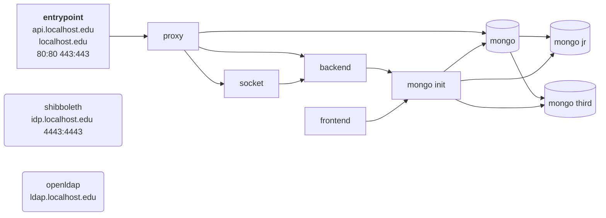
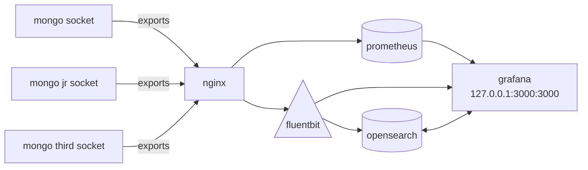

# Architecture

Meetme is build with the idea of splitting things up, things should do 1 thing.
Everything is ideally split into its own container, which is then orchestrated using
compose (either docker or podman). A main overview of each component is

## Frontend and Backend

Ran using the `Docker-compose-split-ssl.yml` file.

`entrypoint`
: This runs the front facing nginx server and handles ssl

`proxy`
: An internal nginx server use for communication between internal components

`mongo`, `mongo-jr`, `mongo-third`
: MongoDB databses, three are required for replication

`backend`
: Backend

`frontend`
: Frontend

`socket`
: Runs the websocket, which communicates between the database and frontend nginx

`openldap`
: LDAP, this gives us access to netids used for authentication

`shibboleth`
: Shibboleth authentication, this manages SSO and authentication

## Admin

Metrics and logs are forwarded to an admin dashboard, which is ran separately
from the functional components. This can be ran using `docker-compose-admin.yml`.

`grafana`
: The admin dashboard

`os01`
: Essentially a database of stored logs and allows us to run search and sort queries on them

`fluentbit`
: This format logs and then exports them to grafana

`nginx_soc2http`
: Nginx service which communicates data between the database sockets and the services here

`prometheus`
: Collects metrics (of databases for example) and exports them grafana

