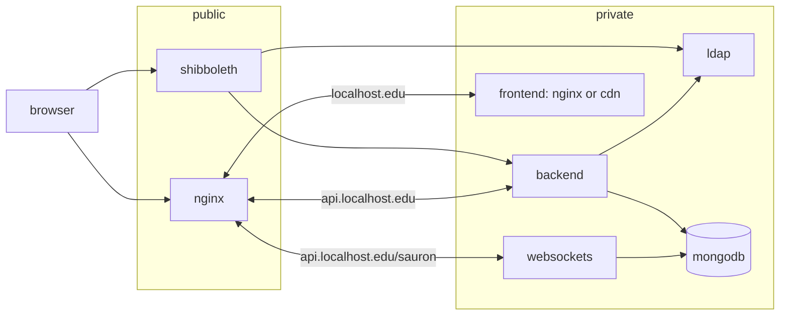
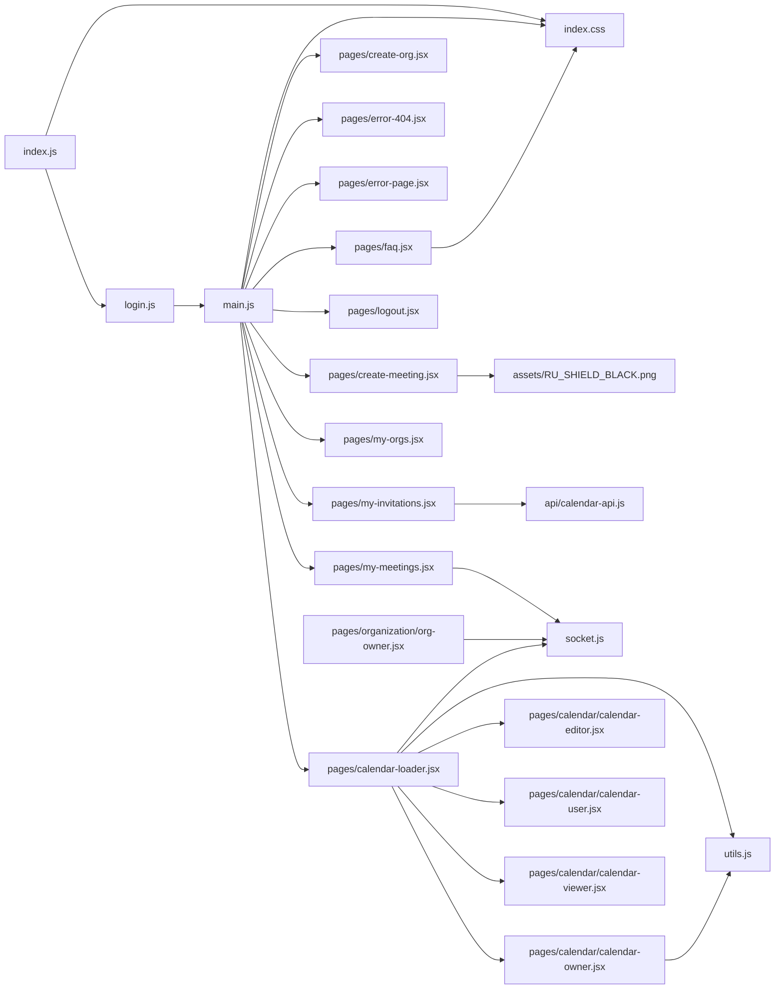
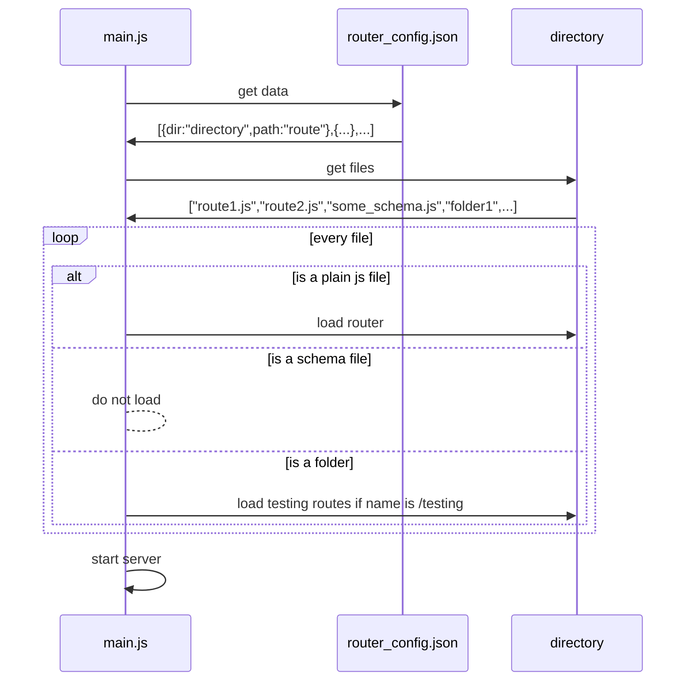
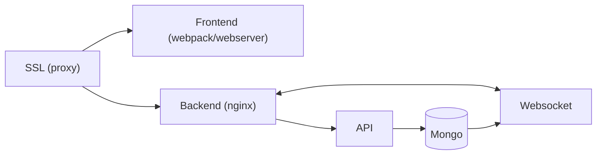

## Standard development environment setup

``` mermaid
flowchart LR
    client[browser] --> proxy[nginx];
    client --> shibboleth[shibboleth];
    subgraph public
        proxy[nginx];
        shibboleth[shibboleth];
    end

    subgraph private
        proxy <--> |api.localhost.edu| backend[backend];
        proxy <--> |localhost.edu| frontend[frontend: nginx or cdn];
        proxy <--> |api.localhost.edu/sauron| websockets[websockets];
        backend --> ldap[ldap];
        websockets --> mongodb[(mongodb)];
        backend --> mongodb
        shibboleth --> backend
        shibboleth --> ldap
    end
```

## Frontend Architecture

``` mermaid
flowchart LR
index.js --> index.css
index.js --> login.js
login.js --> main.js
main.js --> index.css
main.js --> pages/calendar-loader.jsx
main.js --> pages/create-meeting.jsx
pages/create-meeting.jsx --> assets/RU_SHIELD_BLACK.png
main.js --> pages/create-org.jsx
main.js --> pages/error-404.jsx
main.js --> pages/error-page.jsx
main.js --> pages/faq.jsx
main.js --> pages/logout.jsx
main.js --> pages/my-invitations.jsx
main.js --> pages/my-orgs.jsx
pages/my-invitations.jsx --> api/calendar-api.js
main.js --> pages/my-meetings.jsx
pages/my-meetings.jsx --> socket.js
pages/organization/org-owner.jsx --> socket.js
pages/calendar-loader.jsx --> socket.js
pages/calendar-loader.jsx --> utils.js
pages/calendar-loader.jsx --> pages/calendar/calendar-owner.jsx
pages/calendar-loader.jsx --> pages/calendar/calendar-editor.jsx
pages/calendar-loader.jsx --> pages/calendar/calendar-user.jsx
pages/calendar-loader.jsx --> pages/calendar/calendar-viewer.jsx
pages/calendar/calendar-owner.jsx --> utils.js
pages/faq.jsx --> index.css
```

## Backend Architecture

``` mermaid
sequenceDiagram
    main.js ->> router_config.json: get data
    router_config.json ->> main.js: [{dir:"directory",path:"route"},{...},...]
    participant directory
    main.js ->> directory: get files
    directory ->> main.js: ["route1.js","route2.js","some_schema.js","folder1",...]
    loop every file
        alt is a plain js file
            main.js->>directory: load router
        else is a schema file
            main.js-->main.js: do not load
        else is a folder
            main.js->>directory: load testing routes if name is /testing
        end
    end
    main.js ->> main.js: start server
```

## Proxy Architecture

``` mermaid
flowchart LR
    SSL["SSL (proxy)"] --> Frontend["Frontend (webpack/webserver)"] & Backend["Backend (nginx)"]
    Backend --> API["API"]
    Backend <--> Websocket
    Mongo --> Websocket
    API --> Mongo[("Mongo")]
```
